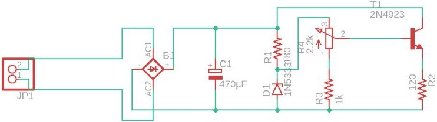
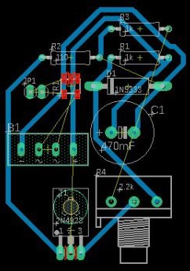

# SCC0180 - Eletrônica para a Computação: Fonte 3 ~ 12V

### Alunos:
- Alexandre Lima Palles Rocha - 11797038 - [Github](https://github.com/Alexandre-Palles)
- Matheus Barcellos de Castro Cunha - 11208238 - [Github](https://github.com/matheushw)

### Foto do circuito no Falstad:
### 

<!-- ### Esquemático da fonte no EAGLE:
### 

### Esquemático da PCB no EAGLE:
###  -->

# Componentes
| **Quantidade** | **Componente** | **Especificações** | **Valor** |
|:---------------:|:---------------:|:-------------:|:---------------:|
| 1x |[Switch](https://produto.mercadolivre.com.br/MLB-1300399738-boto-chave-gangorra-mini-interruptor-liga-desliga-on-off-10x15mm-kcd13-101-3a-250v-arduino-_JM?variation=42249952649&quantity=1#reco_item_pos=0&reco_backend=machinalis-seller-items-pdp&reco_backend_type=low_level&reco_client=vip-seller_items-above&reco_id=3b5ba658-e897-4edb-bdb5-659b62db67cc) | 250V e 3A | R$7,99 |
| 1x |[Transformador](https://produto.mercadolivre.com.br/MLB-1304922688-transformador-trafo-1818v-200ma-bivolt-eletrnica-_JM?matt_tool=82322591&matt_word&gclid=CjwKCAjwxev3BRBBEiwAiB_PWBbZ2aHFM5DoBshLVzkNvkgx2N9hKW23WtSlJJcJrxYljOzxjykEoRoCScYQAvD_BwE&quantity=1) | 18V e 200mA | R$27,99 |
| 4x |[Diodo](https://www.autoeletronica.net/produtos/diodo-retificador-1n5404) | 400V e 3A | R$1,52 |
| 10x |[Resistor](https://produto.mercadolivre.com.br/MLB-1572512618-resistor-22k-18w-1-thru-hole-10-unidades-_JM?matt_tool=79246729&matt_word&gclid=CjwKCAjwxev3BRBBEiwAiB_PWOBvqco0yUZbPd3xXd7Ti-PVZdboXUzZH0d8ussTLM_GGaiamZP50BoCfEoQAvD_BwE&quantity=1) | 2.2kΩ | R$7,49 |
| 10x |[Resistor](https://produto.mercadolivre.com.br/MLB-1571424869-kit-10-x-resistor-15k-ohm-5-14w-025w-leds-5mm-arduino-_JM?matt_tool=79246729&matt_word=&gclid=CjwKCAjwxev3BRBBEiwAiB_PWCWiESX0zQ_fqSwU5-CIx2PRklAiqlIU_7MRDs36guL9Ud44XvO00RoCT64QAvD_BwE) | 1.5kΩ | R$8,65 |
| 10x |[Resistor](https://produto.mercadolivre.com.br/MLB-1018650605-kit-10-x-resistor-120-ohm-5-14w-025w-120r-arduino-pic-_JM?matt_tool=79246729&matt_word&gclid=CjwKCAjwxev3BRBBEiwAiB_PWKfn6PA1H1P_61IlRabAfL3WufIbumeBCf10bZfJuTmiYePV2-X9HRoCi9cQAvD_BwE&quantity=1) | 120Ω | R$8,65 |
| 1x |[Capacitor](https://www.eletrogate.com/capacitor-eletrolitico-470uf-x-50v?utm_source=Site&utm_medium=GoogleMerchant&utm_campaign=GoogleMerchant&gclid=Cj0KCQjw3Nv3BRC8ARIsAPh8hgJ2Kgakz5yJfnDUHAmi37V7dUP6w2IKSyBl1VksmPlQwvk_MMea2ZgaAmnKEALw_wcB) | 470uF | R$0,90 |
| 1x |[Diodo Zener](https://www.americanas.com.br/produto/1397103736?opn=YSMESP&sellerid=4145166000157&epar=bp_pl_00_go_am_todas_geral_gmv&WT.srch=1&acc=e789ea56094489dffd798f86ff51c7a9&i=5dd8ae5049f937f6254fab94&o=5df60079f8e95eac3dac6177&gclid=Cj0KCQjw3Nv3BRC8ARIsAPh8hgIL562GLJVjPZFYEWPE8kXANQGuBsye2JKJisaPoG6w3PX7TJy3cGIaAltrEALw_wcB) | 13V e 1W | R$0,60 |
| 1x |[Potenciômetro](https://www.magazineluiza.com.br/potenciometro-5k-linear-estriado-15mm-wh148-b5k-l15-ncl/p/cb244eacd6/cj/ptct/?&1=1&seller_id=casadarobotica&&utm_source=google&utm_medium=pla&utm_campaign=&partner_id=54222&gclid=CjwKCAjwxev3BRBBEiwAiB_PWCzLCRQFZbqyxHrqGAP6q1-wtv8JZTKYs0IlJbpythvAmF4CQ-itcRoCl3wQAvD_BwE) | 5kΩ | R$1,99 |
| 1x |[Transistor](https://www.google.com/search?q=npn+548&sxsrf=ALeKk01A8u6ooJoB3f3bC7uwXjp92MkR_w:1593545294101&source=lnms&tbm=shop&sa=X&ved=2ahUKEwj5xMDpoqrqAhVhA9QKHa4iDHoQ_AUoAnoECBAQBA&biw=1280&bih=689#spd=3025372831872072528) | NPN BC548 | R$0,27 |
|Custo Total || | **R$66,05** |

# Links
- Fonte no Falstad **[aqui](http://tinyurl.com/ycx5dwek)**
- Video de explicação do projeto **[aqui]()**
- Projeto no EAGLE **[aqui]()**
