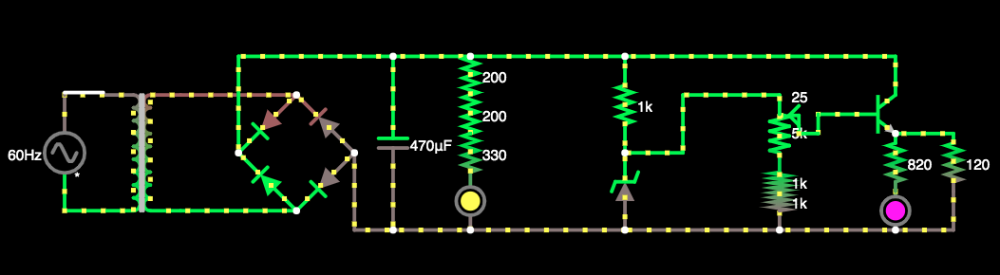
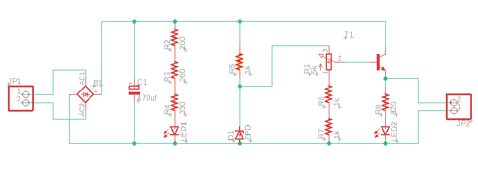
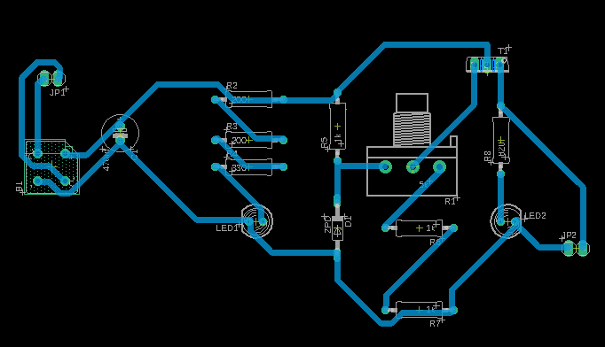
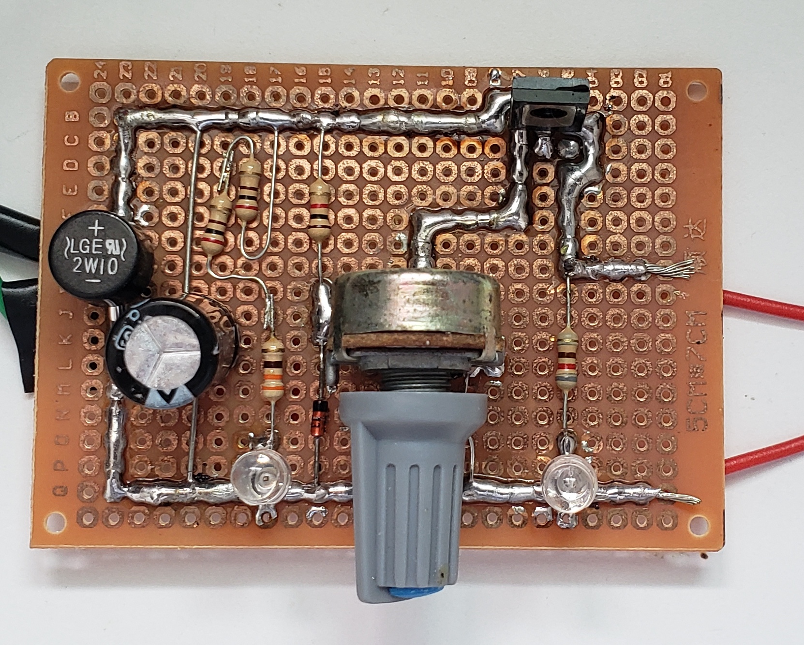

# SCC0180 - Eletrônica para a Computação: Fonte 3 ~ 12V

### Alunos:
- Alexandre Lima Palles Rocha - 11797038 - [Github](https://github.com/Alexandre-Palles)
- Matheus Barcellos de Castro Cunha - 11208238 - [Github](https://github.com/matheushw)

### Foto do circuito no Falstad:
### 

### Esquemático da fonte no EAGLE:
### 

### Esquemático da PCB no EAGLE:
### 

### Parte física:
### 
### 

# Componentes
| **Quantidade** | **Componente** | **Especificações** | **Valor** |
|:---------------:|:---------------:|:-------------:|:---------------:|
| 1x |[Switch](https://produto.mercadolivre.com.br/MLB-1300399738-boto-chave-gangorra-mini-interruptor-liga-desliga-on-off-10x15mm-kcd13-101-3a-250v-arduino-_JM?variation=42249952649&quantity=1#reco_item_pos=0&reco_backend=machinalis-seller-items-pdp&reco_backend_type=low_level&reco_client=vip-seller_items-above&reco_id=3b5ba658-e897-4edb-bdb5-659b62db67cc) | 250V e 3A | R$7,99 |
| 1x |[Transformador](https://www.americanas.com.br/produto/213215611/transformador-entrada-110-220-saida-0-15v-500ma?WT.srch=1&acc=e789ea56094489dffd798f86ff51c7a9&epar=bp_pl_00_go_pla_casaeconst_geral_gmv&gclid=CjwKCAjwrvv3BRAJEiwAhwOdMyr-fa3ot-LV1x7yE8mnru6MTkeDwGg72wlTrGV24NYcF5T_Roa2sBoCFkIQAvD_BwE&i=5d712b2d49f937f6250d8225&o=5d6e96436c28a3cb509126ac&opn=YSMESP&sellerid=10428528000110) | 15V e 500mA | R$28,17 |
| 4x |[Diodo](https://www.autoeletronica.net/produtos/diodo-retificador-1n5404) | 400V e 3A | R$1,52 |
| 10x |[Resistor](https://www.magazineluiza.com.br/20-resistor-200-ohm-1-4w-casa-da-robotica/p/jahg4d02bd/rc/rcnm/?&1=1&seller_id=casadarobotica&&utm_source=google&utm_medium=pla&utm_campaign=&partner_id=54222&gclid=CjwKCAjwrvv3BRAJEiwAhwOdM0nr_gGCuMlmJNNXnZJc7zP40bANqfRbu4sNi5f4ybwsfB4tmBOP2RoCRtsQAvD_BwE) | 200Ω | R$2,99 |
| 10x |[Resistor](https://produto.mercadolivre.com.br/MLB-1081590858-resistor-330-ohm-14w-x10-unidades-_JM?matt_tool=79246729&matt_word&gclid=CjwKCAjwrvv3BRAJEiwAhwOdMxfc-Wb-Vj7uST-Bl0sPwud6hYj0OiS_j8SGzs_ZKOX0M5Ny0XoHoBoCj-QQAvD_BwE&quantity=1) | 330Ω | R$6,99 |
| 10x | Resistor | 820Ω | R$5,00 |
| 10x |[Resistor](https://www.robocore.net/loja/itens-eletronicos/resistor-1k-pacote-com-10-unidades?gclid=CjwKCAjwrvv3BRAJEiwAhwOdMwuhosSM-JDTUyn6lY5W_EmAhNuJSJ3X4foISeOunrbZ_ssohOUY9RoCutkQAvD_BwE) | 1kΩ | R$0,75 |
| 1x |[Capacitor](https://www.eletrogate.com/capacitor-eletrolitico-470uf-x-50v?utm_source=Site&utm_medium=GoogleMerchant&utm_campaign=GoogleMerchant&gclid=Cj0KCQjw3Nv3BRC8ARIsAPh8hgJ2Kgakz5yJfnDUHAmi37V7dUP6w2IKSyBl1VksmPlQwvk_MMea2ZgaAmnKEALw_wcB) | 470uF e 50V | R$0,90 |
| 1x |[Diodo Zener](https://www.americanas.com.br/produto/1397103736?opn=YSMESP&sellerid=4145166000157&epar=bp_pl_00_go_am_todas_geral_gmv&WT.srch=1&acc=e789ea56094489dffd798f86ff51c7a9&i=5dd8ae5049f937f6254fab94&o=5df60079f8e95eac3dac6177&gclid=Cj0KCQjw3Nv3BRC8ARIsAPh8hgIL562GLJVjPZFYEWPE8kXANQGuBsye2JKJisaPoG6w3PX7TJy3cGIaAltrEALw_wcB) | 13V e 1W | R$0,60 |
| 1x |[Potenciômetro](https://www.magazineluiza.com.br/potenciometro-5k-linear-estriado-15mm-wh148-b5k-l15-ncl/p/cb244eacd6/cj/ptct/?&1=1&seller_id=casadarobotica&&utm_source=google&utm_medium=pla&utm_campaign=&partner_id=54222&gclid=CjwKCAjwxev3BRBBEiwAiB_PWCzLCRQFZbqyxHrqGAP6q1-wtv8JZTKYs0IlJbpythvAmF4CQ-itcRoCl3wQAvD_BwE) | 5kΩ | R$1,99 |
| 1x |[Transistor](https://www.robocore.net/loja/itens-eletronicos/transistor-npn-tip122?gclid=CjwKCAjwrvv3BRAJEiwAhwOdMyDcuF7SIPu1UlRnf07BEPSWpM1NQERHKbEpg6RRG2fzJh7GCOJraxoC58sQAvD_BwE) | TIP122 | R$1,75 |
|Custo Total || | **R$58,65** |

# Links
<!-- - Fonte no Falstad **[aqui](http://tinyurl.com/y7b4mfw5)**
- Fonte no Falstad **[aqui](http://tinyurl.com/ya3w26kn)**
http://tinyurl.com/ya4yqcnk
http://tinyurl.com/y976bu3u -->
- Fonte no Falstad **[aqui](http://tinyurl.com/yco9eej4)**
- Video de explicação do projeto **[aqui]()**
- Projeto no EAGLE **[aqui](https://drive.google.com/drive/folders/196MoCWf7vRKy96kijfpoS3ow3kDuRdcu?usp=sharing)**
