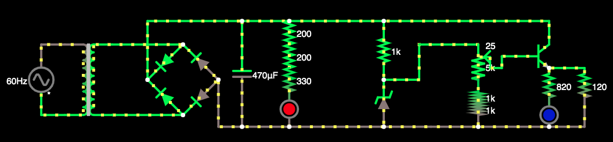

# SSC0180 Fonte 12 ~ 3V

## **SCC0180 - Eletrônica para a Computação**

-------------
## Alunos:
- Alexandre Lima Palles Rocha - 11797038
- Matheus Barcellos de Castro Cunha - 11208238
-------------
## Foto do circuito no Falstad:
## 
-------------
| **Quantidade** | **Componente** | **Especificações** | **Valor** |
|:---------------:|:---------------:|:-------------:|:---------------:|
| 1x |[Switch](https://produto.mercadolivre.com.br/MLB-1300399738-boto-chave-gangorra-mini-interruptor-liga-desliga-on-off-10x15mm-kcd13-101-3a-250v-arduino-_JM?variation=42249952649&quantity=1#reco_item_pos=0&reco_backend=machinalis-seller-items-pdp&reco_backend_type=low_level&reco_client=vip-seller_items-above&reco_id=3b5ba658-e897-4edb-bdb5-659b62db67cc) | 250V e 3A | R$8,00 |
| 1x |[Transformador](https://produto.mercadolivre.com.br/MLB-1253723183-transformador-trafo-2424v-300ma-bivolt-eletronica-_JM?matt_tool=82322591&matt_word&gclid=Cj0KCQjw3Nv3BRC8ARIsAPh8hgLXZgnFr5Hp9iApZDPNMp8cpAg7tn35FChWVQIqDIILeqjcO1U_S98aArt6EALw_wcB&quantity=1) | 24V e 300mA | R$29,99 |
| 4x |[Diodo](https://www.autoeletronica.net/produtos/diodo-retificador-1n5404) | 400V e 3A | R$0,38 |
| 1x |[Kit resistores](https://produto.mercadolivre.com.br/MLB-1508963482-kit-resistores-essenciais-14w-500pcs-escolha-10-valores-_JM?matt_tool=79246729&matt_word&gclid=Cj0KCQjw3Nv3BRC8ARIsAPh8hgIupt2nVKXXqpCT_FToIKbaTNeMJ-NzZfGllE_OkiuEosBMVT6fUeoaAgiaEALw_wcB&quantity=1) | 10Ω/100Ω/1kΩ | R$30,00 |
| 1x |[Capacitor](https://produto.mercadolivre.com.br/MLB-1499835576-capacitor-eletrolitico-1mf-x-400v-kit-c10-pcs-_JM?quantity=1#position=1&type=item&tracking_id=fa215f29-9e58-4df8-935f-7aea9beaf1e2) | 1mF | R$2,87 |
| 1x |[Diodo Zener](https://www.americanas.com.br/produto/1397103736?opn=YSMESP&sellerid=4145166000157&epar=bp_pl_00_go_am_todas_geral_gmv&WT.srch=1&acc=e789ea56094489dffd798f86ff51c7a9&i=5dd8ae5049f937f6254fab94&o=5df60079f8e95eac3dac6177&gclid=Cj0KCQjw3Nv3BRC8ARIsAPh8hgIL562GLJVjPZFYEWPE8kXANQGuBsye2JKJisaPoG6w3PX7TJy3cGIaAltrEALw_wcB) | 13V e 1W | R$0,60 |
| 1x |[Potenciômetro](https://pt.aliexpress.com/item/32848715135.html?src=google&src=google&albch=shopping&acnt=494-037-6276&isdl=y&slnk=&plac=&mtctp=&albbt=Gploogle_7_shopping&aff_atform=google&aff_short_key=UneMJZVf&&albagn=888888&albcp=7303158455&albag=86143156931&trgt=883147839979&crea=pt32848715135&netw=u&device=c&albpg=883147839979&albpd=pt32848715135&gclid=Cj0KCQjw3Nv3BRC8ARIsAPh8hgJCE_fC1pTmLaH6x_OhnIQIG1EOQxaMdB_r3-dds5elVMA30CBOIDAaAkRLEALw_wcB&gclsrc=aw.ds) | 2.2kΩ | R$7,64 |
| 1x |[Transistor](https://www.robocore.net/loja/itens-eletronicos/transistor-npn-tip122?gclid=Cj0KCQjw3Nv3BRC8ARIsAPh8hgLH4DNOuhtfnZSzVS-3N3OBPhqspcy9cVkdt3Z7M0HruGtxnt3bOhQaAqJKEALw_wcB) | NPN TIP122 | R$1,75 |
|Custo Total || | **R$82,37** |

## Fonte no Falstad **[aqui](http://tinyurl.com/ycol5qhn)**
## Video de explicação do projeto **[aqui](https://drive.google.com/file/d/12O8wWkuYkDU50aEyllq8cBlEbAP9AQjk/view?usp=sharing)**
